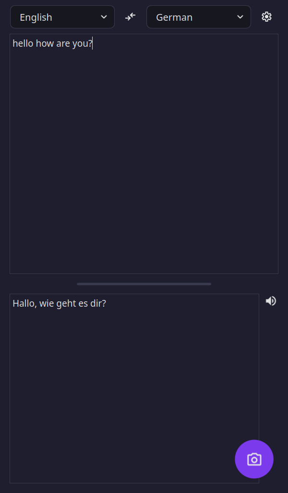
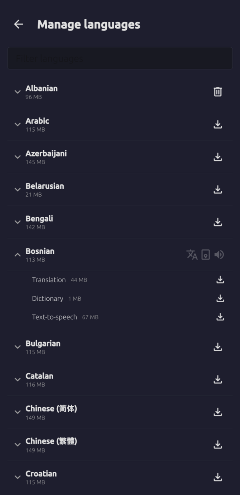
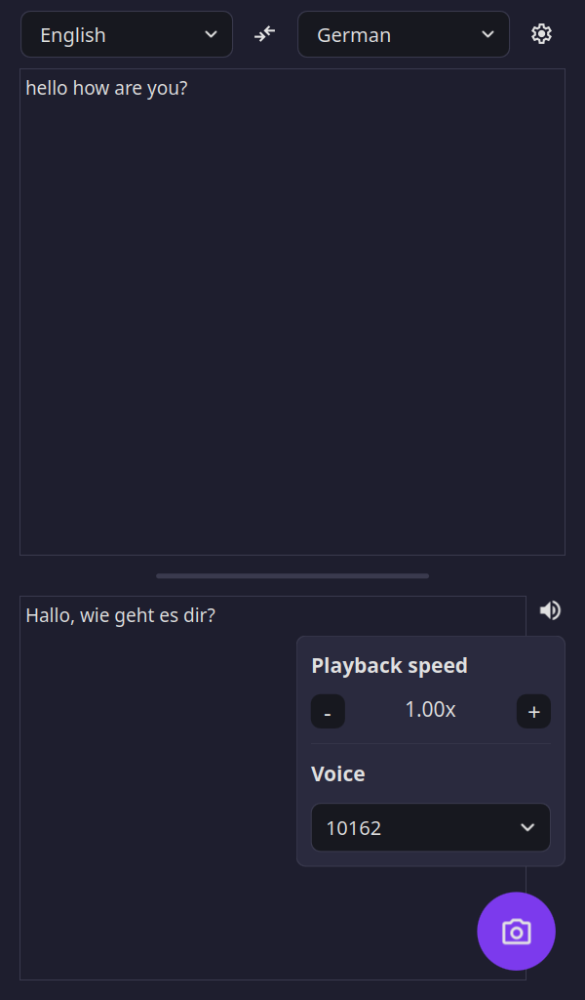

# Offline Translator

Qt port of my [Android offline translator](https://github.com/DavidVentura/firefox-translator), built to run on Linux phones.

It performs text and image translation completely offline using on-device models.
It also supports automatic language detection, transliteration for non-Latin scripts, and a built-in word dictionary.

  
  
  

## How It Works

Download language packs once, then translate without sending requests to external servers.

Language packs contain the translation models, so translation happens entirely on-device.

## Tech

- Translation models are from [firefox-translations-models](https://github.com/mozilla/firefox-translations-models/tree/main)
- Translation runtime is [bergamot-translator](https://github.com/browsermt/bergamot-translator)
- OCR is powered by [Tesseract](https://github.com/tesseract-ocr/tesseract)
- Automatic language detection uses [cld2](https://github.com/CLD2Owners/cld2)
- Dictionary data is based on Wiktionary exports from [Kaikki](https://kaikki.org/)
- TTS uses [Piper](https://github.com/OHF-Voice/piper1-gpl), [Coqui](https://github.com/coqui-ai/tts), [Kokoro](https://github.com/hexgrad/kokoro), [MMS](https://huggingface.co/facebook/mms-tts), [Sherpa ONNX](https://github.com/k2-fsa/sherpa-onnx), and [Mimic3](https://github.com/MycroftAI/mimic3) voices

## Building

Packaging notes and platform-specific build instructions live in [packaging/README.md](packaging/README.md).
